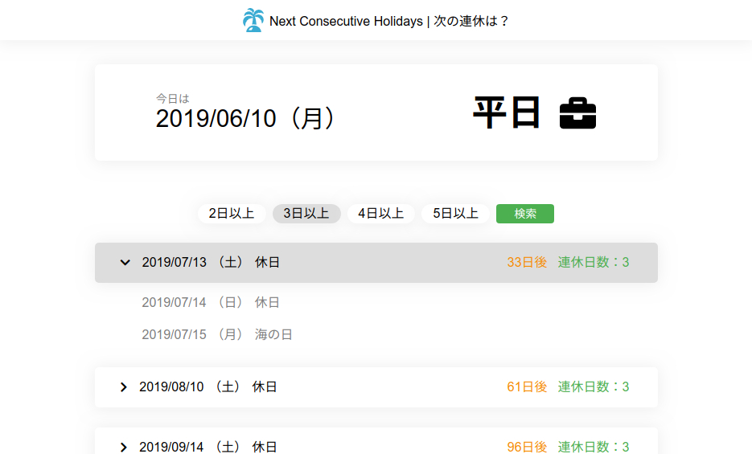

# InformHolidays
====

## Overview
This repository is a project to easily confirm on the web when the consecutive holidays are.

## Description
* Created by python framework flask.
* It consists only of very easy processing.
* **This tool is based on Cabinet Office data.**
  * [「国民の祝日」について | 内閣府](https://www8.cao.go.jp/chosei/shukujitsu/gaiyou.html)

## Demo

## Requirement
Please check the 'requirements.txt'.